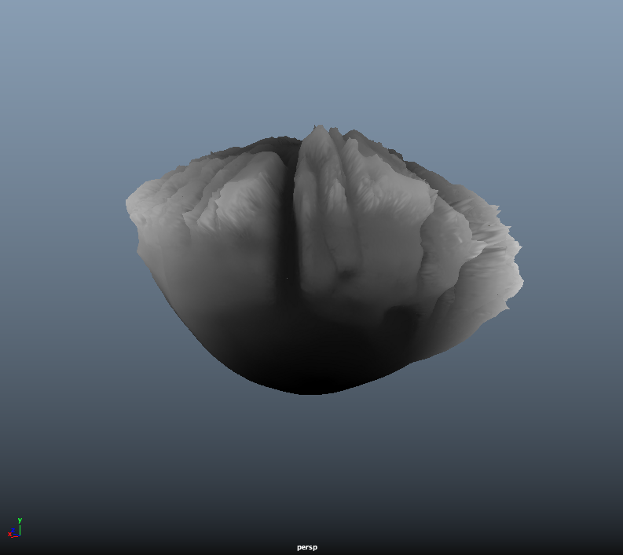

# Z360 Mesh Preview for Maya - 2017-10-23 #

By Andrew Hazelden  
email:  [andrew@andrewhazelden.com](mailto:andrew@andrewhazelden.com)  
web: [www.andrewhazelden.com](http://www.andrewhazelden.com)  

## Z360 Blog Post ##

You can watch a YouTube overview video that shows how the Z360 Maya project file works:  

[https://www.youtube.com/watch?v=mn1B8eLg770](https://www.youtube.com/watch?v=mn1B8eLg770)

## About Z360 ##

This Maya project shows a sample workflow for loading and displaying 6DOF compatible Stereo VR imagery that is delivered in the Z360 style Over/Under formatted color + depthmap image layout.

Z360 style images are a handy way to deliver a 2D color equirectangular image and a depthmap to the end user. By merging the views in an over/under layout you can deliver this format to a 360&deg; playback tool that can display the footage in a 6DOF fashion. 

The KartaVR for Fusion plugin supports displaying a Z360 image using the Z360Mesh3D node. It can be used to convert a Z360 formatted image/image sequence/movie into a standard equirectangular stereo 3D left and right view image using the "Z360 Stereo" and "Z360 VR Dolly" Nodes.

## About this Maya Scene ##

The Maya scene file "Z360 Mesh Preview.ma" requires Maya 2017 Update 3 or newer to be used so the Viewport 2.0 based [displacement mesh preview mode](
https://knowledge.autodesk.com/support/maya/learn-explore/caas/CloudHelp/cloudhelp/2017/ENU/Maya/files/GUID-DBBA4C02-E4A3-42F2-B1E8-C5F90820C629-htm.html) is supported. 

You need to have Maya's **Preferences > Display > Rendering Engine** setting configured to use the "OpenGL - Core Profile (Strict)" mode to be able to see the displacement preview in the real-time viewport windows.

## Opening the Maya Scene ##

Start by using the Maya "Set Project" command to select the `Z360_Maya_Project` folder.

Then open the `Z360 Mesh Preview.ma` scene file.

Switch the perspective view to look through the "z360StereoCamera" stereo camera by going to the viewport's **Panels > Stereo > z360StereoCamera** menu item.

In the viewport's **Stereo** menu select an option like "Luminance Anaglyph" or "Anaglyph" and put on a pair of 3D glasses. When you pan the scene around you will see a volumetric VR stereo version of the Z360 imagery. You can dolly the view around and pan in any view orientation and the stereo 3D depth effect holds up nicely.

If you have the Maya based [mOculus "VR Plugin"](http://moculus.io/) tool installed you can use it to preview the Z360 scene live on a Oculus Rift or HTC VIVE HMD display with room scale VR head tracking active.

## Z360Sphere Controls ##

The Z360Sphere mesh has a set of custom controls that make it easier to adjust the display settings for the displacement based preview mesh.

Start by selecting the "Z360Sphere1" mesh in the Maya Outliner.

Switch to the "Z360Sphere" tab in the Attribute Editor to look at the transform node settings.

Scroll down in the Attribute Editor window and expand the **Extra Attributes** section. 

You will see a group of custom Z360 preview controls:

### Enable RGB Texture ###

The **Enable RGB Texture** checkbox allows you to toggle the display material in the viewport between showing the color panoramic image or the depthmap image as the surface material.

Enable RGB Texture **ON**:

Enable RGB Texture **OFF**:

### Enable Z360 Displacement ###

The **Enable Z360 Displacement** checkbox allows you to turn the displacement mesh preview on/off. When this checkbox is enabled you will see surface relief on the spherical mesh when the Viewport 2.0 rendering mode is active.

When the checkbox is **OFF** the Z360Sphere1 mesh will be smooth:

When the checkbox is **ON** the Z360Sphere1 mesh will be displaced:

### Z360 Filename ###

This control is used to select the Z360 image/image sequence that will be mapped onto the preview mesh. This textfield is connected internally to both the color and depth file nodes in the Hypershade so you only have to update the texture map filename in a single place.

This project comes with two sample Z360 formatted images:

    sourceimages/z360_stereo.0001.jpg
    sourceimages/z360_stereo_fall_colors_with_tripod.0001.jpg

The `z360_stereo.0001.jpg` image was created by stitching live action 360&deg; stereo footage using Fusion Studio and KartaVR. A disparity mapping workflow created the depthmap image data from the left and right fisheye views in the stereo camera rig.

The `z360_stereo_fall_colors_with_tripod.0001.jpg` image was created by manually painting a depthmap in Fusion using a rotoscoping approach.

### Use Image Sequence ###

This control allows you to load image sequences into the "Z360 Filename" textfield and have them update live in the Maya timelime.

The "Use Image Sequence" checkbox is expression linked to the "z360ColorFile" and "z360DepthFile" nodes and will control the two file node's **[x] Use Image Sequence** setting.

**Note:** Maya 2017's new viewport 2.0 based displacement preview mode needs to have the **Use Interactive Sequence Caching** checkbox disabled on the "z360ColorFile" and "z360DepthFile" nodes. If the Use Interactive Sequence Caching option is turned on, you won't see the displacement effect update in the viewport.

### Displacement Gain ###

This control adjusts the **Alpha Gain** setting on the Maya File node for the depth image data. Raising this number will push the displacement depth further off the surface of the preview sphere.

### Displacement Offset ###

This control adjusts the **Alpha Offset** setting on the Maya File node for the depth image data. Raising this number will shift the whole displacement effect outwards evenly.

### Displacement Scale ###

This control adjusts the z360DisplacementShader's **Scale** setting and will make the sphere "inflate" larger in the scene which can be useful if you need to adjust the scene scale to work with an Stereo HMD's native convergence and camera separation settings.
